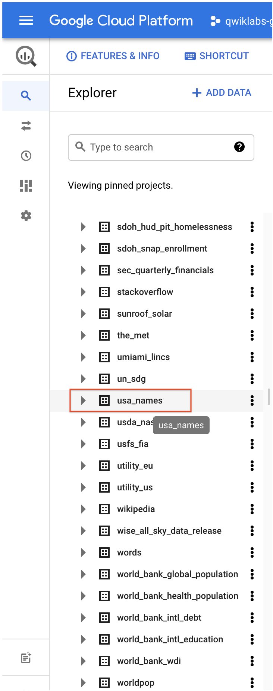

# Week 1 Labs

## Lab 1
Lab: Exploring a BigQuery Public Dataset


sample schema
```
name:string,gender:string,count:integer
```


You need a table to hold the dataset.

-[ ] True

-[ ] False

In this lab, you will explore publicly available datasets using BigQuery for big data analysis. Specifically you will:

Query a public dataset

Create a custom table

Load data into a table

Query a table

Tips for Course Labs
Get the most out of Coursera and Qwiklabs by trying our tips below.

Avoid account confusion with private browsing
Close this page and log back in to Coursera in Incognito mode before moving on. When you return to this course and lab instructions page, click Open Tool to continue.

By using incognito mode, this ensures that you don't accidentally use your own Google account (including Gmail) while accessing the Google Cloud Console. This also prevents Qwiklabs from logging you out of your own Google accounts.


[Babynames zfile](./resources-names.zip)
The zip file contains a NationalReadMe.pdf file that describes the dataset. Learn more about the dataset.

Open the file named yob2014.txt to see what the data looks like. The file is a comma-separated value (CSV) file with the following three columns: name, sex (M or F), and number of children with that name. The file has no header row.

Note the location of the yob2014.txt file so that you can find it later.



Task 2. Create a custom table
In this task, you create a custom table, load data into it, and then run a query against the table.

Download the data to your local computer

Task 3. Create a dataset
In this task, you create a dataset to hold your table, add data to your project, then make the data table you'll query against.

On the Create dataset page:

For Dataset ID, enter babynames.
For Data location, choose United States (US).
For Default table expiration, leave the default value.
For Encryption, leave the default value.
Currently, the public datasets are stored in the US multi-region location . For simplicity, place your dataset in the same location.

Task 4. Load the data into a new table
In this task, you load data into the table you made.

In the navigation pane, click babynames from the Explorer section, and then click on the three dots next to babynames and then click Open.

Click on Create table in the right side pane.
Use the default values for all settings unless otherwise indicated.

On the Create table page:

For Source, choose Upload from the Create table from: dropdown menu.

For Select file, click Browse, navigate to the yob2014.txt file and click Open.

For File format, choose CSV from the dropdown menu.

For Table name, enter names_2014.

In the Schema section, click the Edit as text toggle and paste the following schema definition in the text box.

```
name:string,gender:string,count:integer
```

Task 5. Query the table
Now that you've loaded data into your table, you can run queries against it. This query retrieves the top 5 baby names for US males in 2014.


